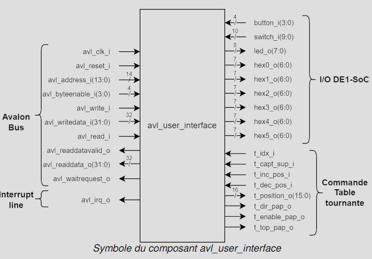
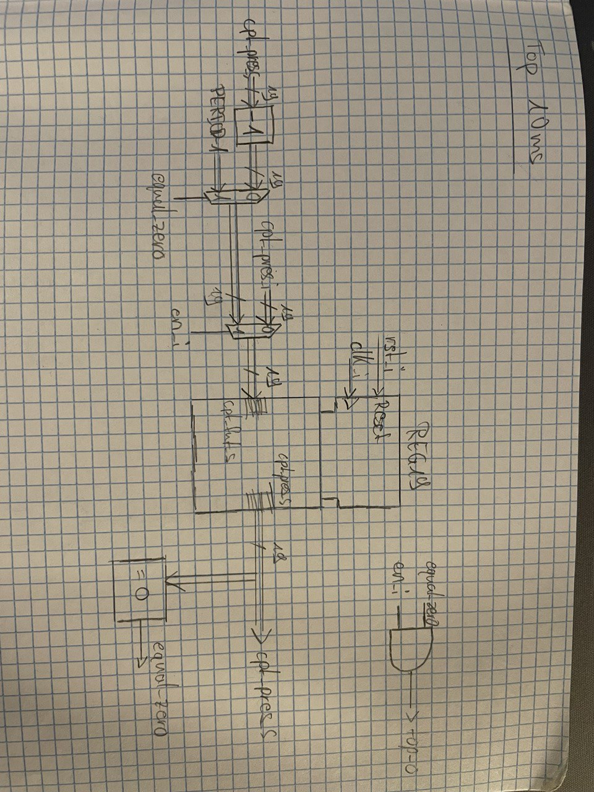

# **Laboratoire 6: Conception d’une table tournante**

## Auteurs : *Miguel Jalube* et *Bastien Pillonel*

## Sommaire

- [Introduction](#introduction)

- [Conception de l'interface](#conception-de-linterface)

  - [Plan d'adressage](#plan-dadressage)

  - [Canal d'écriture](#canal-décriture)

  - [Canal de lecture](#canal-de-lecture)

  - [Générateur de top](#générateur-de-top)

  - [Diviseur de frequence](#diviseur-de-frequence)

  - [Masquage des IRQ et commande moteur](#masquage-des-irq-et-commande-moteur)

  - [Machines d'état](#machine-d_etat)

    - [Machine d'état pour la calibration/initialisation](#link)

    - [Machine d'état pour le déplacement](#link)

    - [Machine d'état pour les IRQ](#link)

  - [Synthèse](#synthèse)

- [Conclusion](#conclusion)

## Introduction
Ce laboratoire a pour but de concevoir une application de commande d’une table 
tournante avec l’utilisation de plusieurs afficheurs externe. Le laboratoire comprendra 
plusieurs étapes : 
- Mise en œuvre d’une interface UART du HPS, afin d’envoyer des messages 
dans un terminal distant. 
- Développement et interfaçage des commandes de la table tournante. 
- Développement et interfaçage des capteurs de la table tournante avec 
compteur de position. 
- Implémentation d’un générateur de top pour le moteur afin de pouvoir 
sélectionner 4 vitesses différentes dans la FPGA. 
- Mise en œuvre des interruptions du HPS générées par un dépassement de 
position de la table depuis la partie FPGA.

## Conception de l'interface

### Schema bloc

### Plan d'adressage
Le plan d'adressage est le suivant :

Les adresses disponibles pour les nouvelles fonctionnalités ont été utilisées comme suit :

- 0x18 : lecture et écriture -> position courante
- 0x1c : lecture et écriture -> bits 3..2 : vitesse moteur, bit 1 : direction moteur, bit 0 : enable moteur
- 0x20 : lecture -> bit 0 : calibration/initialisation en cours, ecriture -> bit 0 : lancer calibration/initilisation
- 0x24 : lecture et écriture -> bit 0 : position après depl. auto
- 0x28 : lecture et écriture -> déplacement en cours
- 0x2c : lecture -> bit 1 : limite maximale atteinte, bit 0 :limite minimale atteinte, ecriture -> bit 1 : masquage des irq, bit 0 : acknowledge irq

## Canal d'écriture

## Canal de lecture

## Générateur de top

### Voici les mesures à l'oscilloscope pour les différentes vitesses de la table tournante (les périodes sont doublées) :

**5 Hz / Viteese petite**

**12.5 Hz / Vitesse moyenne**

**25 Hz / Vitesse grande**

**50 Hz / Vitesse très grande**

## Diviseur de frequence

## Masquage des IRQ et commande moteur

## Machine d'état

La solution proposée pour le laboratoire utilise 3 machines d'état.

### Machine d'état pour la calibration/initialisation

### Machine d'état pour le déplacement

### Machine d'état pour les IRQ

### UART
L'UART requiert certains paramètres pour fonctionner correctement. Voici les paramètres utilisés pour ce laboratoire :

1. Baudrate: Le baudrate doit être défini à 9600. Pour calculer les valeurs de Divisor Latch Low (DLL) et Divisor Latch High (DLH), vous pouvez utiliser la formule fournie dans la documentation : 

​Puisque l'horloge l4_sp_clk est à 100 MHz, le diviseur à utiliser pour obtenir un baudrate de 9600 est : 

2. Bit de données: Pour définir le nombre de bits de données à 8, vous devrez vous assurer que le bit DLAB (Divisor Latch Access Bit) du registre LCR (Line Control Register) est réglé sur 0 pour désactiver l'accès aux registres du diviseur. Ensuite, configurez les bits de données du registre LCR pour 8 bits.

3. Bit de parité désactivé: Dans le registre LCR, assurez-vous que les bits de parité sont désactivés, ce qui est généralement le réglage par défaut.

4. Bit de stop: Configurez le registre LCR pour un seul bit de stop.
Activer les buffers FIFO en émission et réception: Activez les FIFO en écrivant dans le registre FCR (FIFO Control Register). 

## Synthèse

La synthèse montre que le système tourne avec 825 registres ce qui est beaucoup comparé aux laboratoires précédents. Le professeur a cependant indiqué lors du laboratoire précédent que le nombre de registres compté par quartus n'était pas fiable à 100%.

## Conclusion

En conclusion de ce projet de conception d'une table tournante avec une interface avl_user_interface, les objectifs ont été atteints. La mise en œuvre de l'interface UART0 du HPS a été réalisée avec succès, en s'appuyant sur la documentation du Cyclone V.

Le plan d'adressage de l'interface avl_user_interface a été modifié progressivement tout le long du laboratoire. La partie initialisation/calibration ont été les seules fonctionnalités complexes décrites en VHDL plutôt que codées en C. Malgré la préférence d'intégrer le code complexe en soft plutôt qu'en hard, la latence du bus ne permet pas d'atteindre la précision souhaitée si codée côté soft.

Le générateur de top a été intégré avec succès dans l'interface, et la fréquence du signal top a été vérifiée à l'oscilloscope pour respecter la contrainte de ne jamais dépasser 100 Hz.

L'unité de commande de la table tournante a été définie et conçue avec une interface semblable aux laboratoires précédents.

Les interruptions, gérées par un gestionnaire d'interruption conforme aux spécifications, ont été implémentées avec succès. La routine d'interruption fpga_ISR() a été testée avec le toggle de la Led7 de la DE1-SoC.